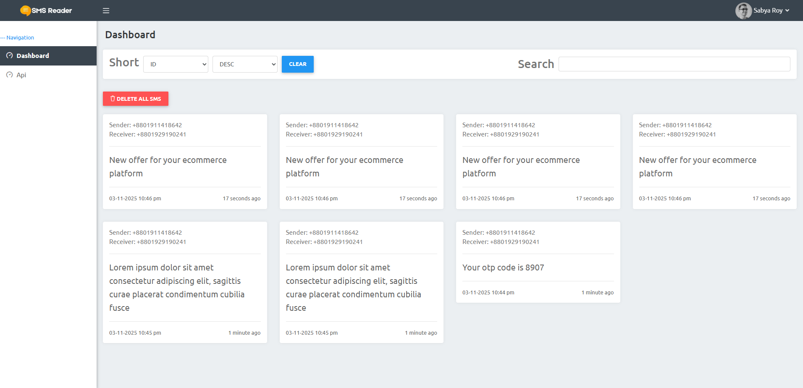

# SMS Reader API & Dashboard

This project is a complete solution for receiving and managing SMS messages via an API. Built with Laravel, it provides robust back-end endpoints to store messages from a phone and a clean, intuitive front-end dashboard to view, search, and manage them.

## 📸 Dashboard Preview

## ✨ Features

-   **RESTful API**: Simple and effective API endpoints to handle SMS data.
-   **Admin Dashboard**: A user-friendly interface to manage all received SMS messages.
-   **View Messages**: All incoming SMS are displayed in a card-based layout for easy reading.
-   **Search Functionality**: Quickly find any message with the built-in search bar.
-   **Sorting Options**: Sort messages by ID in either ascending or descending order.
-   **Bulk Deletion**: A "Delete All SMS" button to clear all messages from the database with a single click.

## 🛠️ Technology Stack

-   **Backend**: Laravel
-   **Frontend**: Blade, CSS, JavaScript
-   **Database**: MySQL (or any other Laravel-supported database)

## 🚀 API Endpoints

The application provides the following API endpoints for interaction:

| Method | URI             | Action                          |
| :----- | :-------------- | :------------------------------ |
| `GET`  | `/api/sms`      | Retrieve a list of all SMS.     |
| `POST` | `/api/sms`      | Store a new SMS in the database.|
| `GET`  | `/api/sms/{id}` | Retrieve a single SMS by its ID.|

## 📖 Usage

-   **API**: Use an API client like Postman or integrate the provided API endpoints into your mobile application to send SMS data to the server.
-   **Admin Panel**: Navigate to `/dashboard` to view and manage the received messages. The dashboard provides all the necessary controls for viewing, searching, and deleting messages.